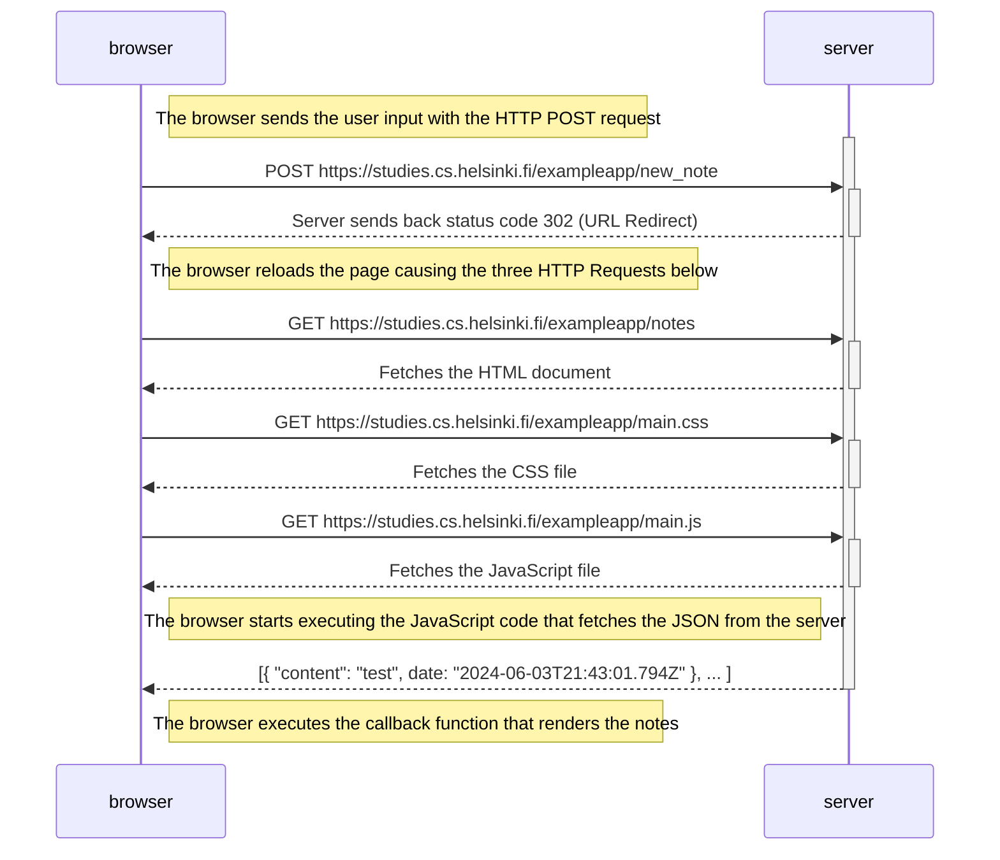

```mermaid
sequenceDiagram
    participant browser
    participant server

    Note right of browser: The browser sends the user input with the HTTP POST request
    activate server
    browser->>server: POST https://studies.cs.helsinki.fi/exampleapp/new_note
    activate server
    server-->>browser: Server sends back status code 302 (URL Redirect)
    deactivate server

    Note right of browser: The browser reloads the page causing the three HTTP Requests below
    browser->>server: GET https://studies.cs.helsinki.fi/exampleapp/notes
    activate server
    server-->>browser: Fetches the HTML document
    deactivate server

    browser->>server: GET https://studies.cs.helsinki.fi/exampleapp/main.css
    activate server
    server-->>browser: Fetches the CSS file
    deactivate server

    browser->>server: GET https://studies.cs.helsinki.fi/exampleapp/main.js
    activate server
    server-->>browser: Fetches the JavaScript file
    deactivate server

    Note right of browser: The browser starts executing the JavaScript code that fetches the JSON from the server

    server-->>browser: [{ "content": "test", date: "2024-06-03T21:43:01.794Z" }, ... ]
    deactivate server
    Note right of browser: The browser executes the callback function that renders the notes
```
