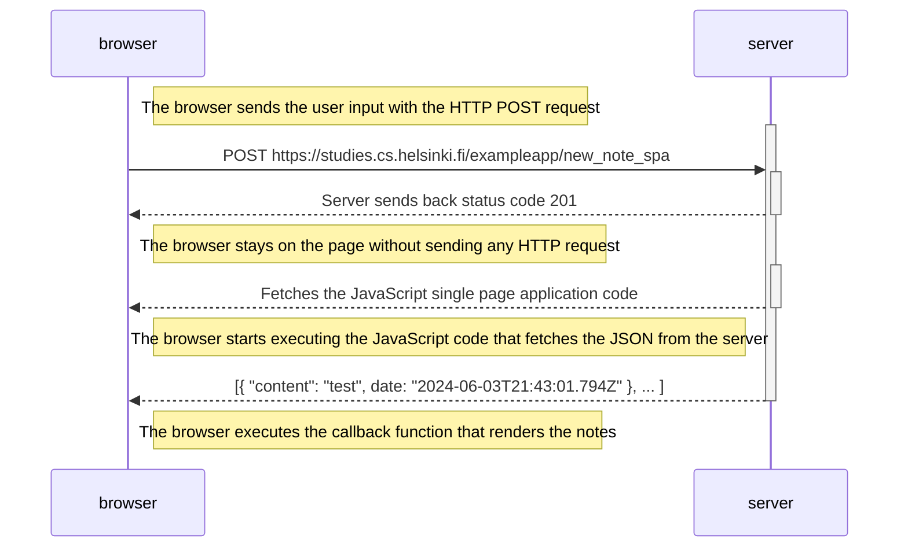

```mermaid
sequenceDiagram
    participant browser
    participant server

    Note right of browser: The browser sends the user input with the HTTP POST request

    activate server
    browser->>server: POST https://studies.cs.helsinki.fi/exampleapp/new_note_spa
    activate server
    server-->>browser: Server sends back status code 201
    deactivate server

    Note right of browser: The browser stays on the page without sending any HTTP request

    activate server
    server-->>browser: Fetches the JavaScript single page application code
    deactivate server

    Note right of browser: The browser starts executing the JavaScript code that fetches the JSON from the server

    server-->>browser: [{ "content": "test", date: "2024-06-03T21:43:01.794Z" }, ... ]
    deactivate server
    Note right of browser: The browser executes the callback function that renders the notes
```
